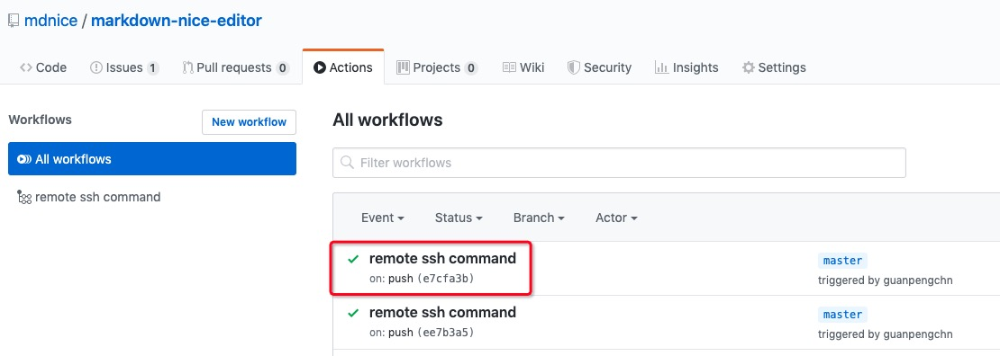

发布一共分为两个过程，分别是组件发布和网站发布

## 组件发布

首先在[markdown-nice](https://github.com/mdnice/markdown-nice)项目下切换到`develop`分支，修改以下内容

- 修改[constant.js](https://github.com/mdnice/markdown-nice/blob/master/src/utils/constant.js#L157-L165)的版本号和发布日志
  - 版本号命名可参考[文章](https://juejin.im/entry/5bf2283ee51d453427606d19)，一般情况下末尾修改加 1 即可
  - 发布日志为精简日志，主要为用户看到后可以体验的，比较小的修复如果在日志过长的情况下可以不显示，在 CHANGELOG.md 中完整显示即可
- 修改[CHANGELOG.md](https://github.com/mdnice/markdown-nice/blob/master/CHANGELOG.md)
- 修改[package.json](https://github.com/mdnice/markdown-nice/blob/master/package.json#L5)的版本号，目前该版本号与上述版本号不一致（一个是网站版本，一个是组件版本），等到组件化完成后再进行统一

修改完成后，并保证`develop`分支功能测试无问题，将`develop`分支提交，并将其合并到`master`分支，再将`master`分支提交

```shell
$ git push origin develop
$ git checkout master
$ git merge develop
$ git push origin master
```

进行组件发布

```shell
$ yarn publish:npm
$ npm publish
```

## 网站发布

首先 clone 并打开[markdown-nice-editor](https://github.com/mdnice/markdown-nice-editor)项目

修改[package.json](https://github.com/mdnice/markdown-nice-editor/blob/master/package.json#L42)中 markdown-nice 版本，版本与上一步发布的一致

修改后重新安装并运行，检测是否有问题存在

```shell
$ yarn
$ yarn start
```

确定无问题后，推送到远程主分支

```shell
$ git push origin master
```

该项目配置了自动集成，推送后请在 github actions 中观察部署情况



部署如果成功，则关闭浏览器（刷新不行，缓存依然在）再打开`https://mdnice.com`，查看是否更新
