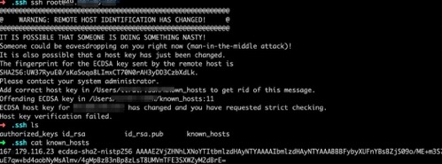

## 腾讯云服务器部署
  
为服务器实例添加ssh

### 问题

连接服务器 ```$ ssh root@ip```时，命令行提示



暂时删掉了原来的known_host文件再进行连接，验证后自动添加了新的known_host,登录成功！

##  创建非root用户

1. 创建一个名为mdnice的用户：`$ adduser mdnice`

2. 为这个用户初始化密码，linux会判断密码复杂度，不过可以强行忽略：`$ passwd mdnice`

3. 授权：

个人用户的权限只可以在本home下有完整权限，其他目录要看别人授权。而经常需要root用户的权限，这时候sudo可以化身为root来操作。我记得我曾经sudo创建了文件，然后发现自己并没有读写权限，因为查看权限是root创建的。

新创建的用户并不能使用sudo命令，需要给他添加授权。

sudo命令的授权管理是在sudoers文件里的。可以看看sudoers

查看权限`$ ls -l /etc/sudoers`

添加写入权限`$  chmod -v u+w /etc/sudoers`

- <span style="color:orangered;font-weight:bold;">可参考：</span>[linux文件权限查看及修改-chmod](https://blog.csdn.net/haydenwang8287/article/details/1753883)

然后就可以添加内容了，在下面的一行下追加新增的用户：`$ vim /etc/sudoers`

```
## Allow root to run any commands anywher  
root    ALL=(ALL)       ALL  
linuxidc  ALL=(ALL)       ALL  #这个是新增的用户
```

wq保存退出，这时候要记得将写权限收回：`$ chmod -v u-w /etc/sudoers`

这时候使用新用户登录，使用sudo：

第一次使用会提示你，你已经化身超人，身负责任。而且需要输入密码才可以下一步。如果不想需要输入密码怎么办，将最后一个ALL修改成NOPASSWD: ALL。

- <span style="color:orangered;font-weight:bold;">可参考：</span>[CentOS 7中添加一个新用户并授权](https://blog.csdn.net/GGxiaobai/article/details/53504989)

## 注意

linux下新建用户后，系统会在/home目录下为用户添加一个以用户名命名的文件夹，在该文件夹下该用户拥有所有权限。

### 问题

CentOS 7.5系统下，用户user的home目录：/home/user的权限变成了777，造成不能正常登陆SSH，报如下错误：Permission denied (publickey,gssapi-keyex,gssapi-with-mic)

### 解决办法

SSH对公钥、私钥的权限和所有权的要求是非常严格的，总结如下：

1. 下面两个目录的所有权必须是user，所属组也应该是user，权限必须为700：

\home\user

\home\user\.ssh

2. 下面公钥文件的所有权必须是user，所属组也应该是user，权限必须为644

\home\user\.ssh\authorized_keys

3. 下面私钥文件的所有权必须是user，所属组也应该是user，权限必须是600

\home\user\.ssh\id_rsa

- <span style="color:orangered;font-weight:bold;">可参考：</span>[SSH关于公钥认证Permission denied ](https://blog.csdn.net/k178441367/article/details/51325116)

### 安装 git, nginx, node, java

1. git安装：`$ yum install git`

git version 1.8.3.1

2. nginx安装：`$ yum install nginx`

nginx version: nginx/1.16.1

nginx启动: `$ sudo systemctl start nginx`

查看状态: `$ sudo systemctl status nginx`

3. node安装：

安装node: 

运行以下curl命令将NodeSource yum存储库添加到您的系统中:

`curl -sL https://rpm.nodesource.com/setup_10.x | sudo bash - `

安装：

`sudo yum install nodejs`

v10.17.0
